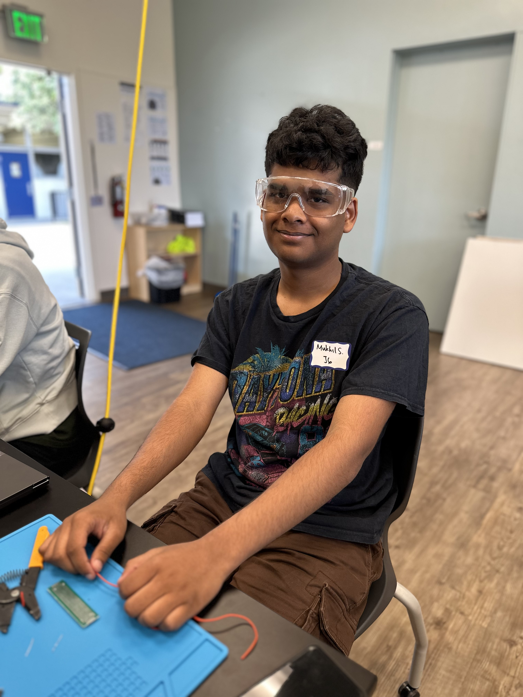

# AI Voice Assistant
This project is an AI voice assistant robot that uses ChatGPT to respond to the user's voice inputted to a Raspberry Pi through a mic, and sends a response via a usb speaker. The robot has a servo for a neck and LED light rings for eyes, that give it a more desiarable appearance.
<!---You should comment out all portions of your portfolio that you have not completed yet, as well as any instructions:-->

| **Engineer** | **School** | **Area of Interest** | **Grade** |
|:--:|:--:|:--:|:--:|
| Mukhil S. | Monta Vista High School | Robotics Engineering | Incoming Senior

<!---**Replace the BlueStamp logo below with an image of yourself and your completed project. Follow the guide [here](https://tomcam.github.io/least-github-pages/adding-images-github-pages-site.html) if you need help.**-->



# Final Milestone

<iframe width="460" height="215" src="https://www.youtube.com/embed/mtxsKrK7zV0?si=MRyunnj10EIA0BUy" title="YouTube video player" frameborder="0" allow="accelerometer; autoplay; clipboard-write; encrypted-media; gyroscope; picture-in-picture; web-share" referrerpolicy="strict-origin-when-cross-origin" allowfullscreen></iframe>

For my final milestone, I've integrated two LED light rings for eyes, enabled the servo to respond to voice commands like "look left", "look right", and "look staraight". I used CAD cad make the 3D printed enclosure to make it look like a friendley robot assistant, and assembled all my components into it.<br/>
My biggest challenges while doing this project were trying to install different libraries to control different parts of the robot, since the Rapberry PI uses virtual environements to function, and debugging code to figure out why ChatGPT wouldn't respond sometimes. Key concepts I learned during my time in Bluestamp include soldering, microcontrollers, debugging, circuits, and project documenting. In the future, I would like to learn PCB design, more python, and better speaking skills.

# Second Milestone

<iframe width="560" height="315" src="https://www.youtube.com/embed/TGL0MrAMzSw?si=00JT6g8z1pI_kYV-" title="YouTube video player" frameborder="0" allow="accelerometer; autoplay; clipboard-write; encrypted-media; gyroscope; picture-in-picture; web-share" referrerpolicy="strict-origin-when-cross-origin" allowfullscreen></iframe>

For my second milestone, I've integrated ChatGPT into the Raspberry Pi, attached a mic and speaker, and also integrated voice commands to contol the LED. When I use the Key word "Tom", the speech recognition module detects it and translates the prompt to text that is processed by ChatGPT. Then the Pi uses Text to Speech to read out the response through the Speaker. Additionally, the LED light is now voice controlled, saying "turn on the light", and "turn off the light", turns on or off the light respectiveley.<br/>
A challenge I'm facing while reaching this milestone is tring to include libraries in my code. A previous challenge I faced that I overcame is setting up SSH and VNC, which now work because of the change in wifi connection. my next milestone will be to aattach the servo and LED light rings to the Raspberry Pi and program them to respond to voice commands.

<!---For your second milestone, explain what you've worked on since your previous milestone. You can highlight:
- Technical details of what you've accomplished and how they contribute to the final goal
- What has been surprising about the project so far
- Previous challenges you faced that you overcame
- What needs to be completed before your final milestone -->

# First Milestone

<iframe width="560" height="315" src="https://www.youtube.com/embed/zLyGwpeoV1g?si=9J3Yrg0rfvxqdN8C" title="YouTube video player" frameborder="0" allow="accelerometer; autoplay; clipboard-write; encrypted-media; gyroscope; picture-in-picture; web-share" referrerpolicy="strict-origin-when-cross-origin" allowfullscreen></iframe>

For my main project, I will be making an AI voice assistant robot. I will be using a Raspberry Pi to facilitate voice conversation with ChatGPT, using a mic and speaker. I will also be integrating a neck servo and led light rings for eyes, in order to give the robot a friendly complexion. For this milestone, I set up the Pi and downloaded OBS Studio on my computer to be able to access the PI. I attached an LED, that I programmed to blink using the Pi, to test if the Raspberry Pi can run code properly. <br/>
A significant challenge I that still needs to be addressed is setting up SSH and VNC. Due to connectivity issues, I am not able to use SSH and VNC to send commands to the PI remotely, which has led me to have to use OBS studio to access the PI, making the project a little harder to work with. For my next milestone, I will be working on integrating a mic, speaker, and integrating th API key for ChatGPT, enabling the PI to facilitate voice conversation with ChatGPT.

<!---For your first milestone, describe what your project is and how you plan to build it. You can include:
- An explanation about the different components of your project and how they will all integrate together
- Technical progress you've made so far
- Challenges you're facing and solving in your future milestones
- What your plan is to complete your project

# Schematics 
Here's where you'll put images of your schematics. [Tinkercad](https://www.tinkercad.com/blog/official-guide-to-tinkercad-circuits) and [Fritzing](https://fritzing.org/learning/) are both great resoruces to create professional schematic diagrams, though BSE recommends Tinkercad becuase it can be done easily and for free in the browser. -->

# Code

```c++
import lgpio 
import speech_recognition as sr 
import pyttsx3 
import openai 
from gpiozero import LED 
from time import sleep 
import RPi.GPIO as GPIO  # Imports the standard Raspberry Pi GPIO library 
GPIO.setmode(GPIO.BOARD) # Sets the pin numbering system to use the physical layout 
led = LED(18) 
GPIO.setup(16,GPIO.OUT)  # Sets up pin 23 to an output (instead of an input) 
p = GPIO.PWM(16, 50)     # Sets up pin 23 as a PWM pin 
p.start(0)               
# Starts running PWM on the pin and sets it to 0 
# initializing pyttsx3 
listening = True 
engine = pyttsx3.init() 
# Set your opeai api key and customize the chatgpt role 
openai.api_key = 
"sk-proj-8mBzxu0P8kanji7640I6qULGyluz6WcZbtD6pz2eAunwpYQRMZrjiiM4qTCwgNRcQotmr
 VqxtNT3BlbkFJGEyZzr-YI83Dd_ntnMU6sbmxyB3dn0OW5dGygKywhvODpB9Klw5F2Zr8w5NY
 DHbctU_46u_1EA" 
messages = [{"role": "system", "content": "Your name is Tom and give answers in two lines"}] 
# CCustomizing the output voices 
voices = engine.getProperty('voices') 
rate = engine.getProperty('rate') 
volume = engine.getProperty('volume') 
# RELAY_GPIO_PIN = 18 
# INITIALIZE THE gpio 
h = lgpio.gpiochip_open(4) 
# set up GPIO pin as output for the relay 
#lgpio.gpio_claim_output(h, RELAY_GPIO_PIN) 
def get_responses(user_input): 
messages.append({"role": "user", "content":user_input}) 
response = openai.ChatCompletion.create( 
model="gpt-3.5-turbo", 
messages=messages 
 ) 
 ChatGPT_reply = response["choices"][0]["message"]["content"] 
 messages.append({"role": "assistant", "content": ChatGPT_reply}) 
 return ChatGPT_reply 
  
def turn_on_light(): 
 led.on() 
 print("Light turned ON") 
  
def turn_off_light(): 
 led.off() 
 print("Light turned OFF") 
  
def look_left(): 
 p.ChangeDutyCycle(10)     # Changes the pulse width to 3 (so moves the servo) 
 sleep(1)                 # Wait 1 second 
 p.ChangeDutyCycle(0) 
 print("Looking left") 
  
def look_right(): 
 p.ChangeDutyCycle(5)    # Changes the pulse width to 12 (so moves the servo) 
 sleep(1) 
 p.ChangeDutyCycle(0) 
 print ("Looking right") 
  
def look_straight(): 
 p.ChangeDutyCycle(7.5)    # Changes the pulse width to 12 (so moves the servo) 
 sleep(1) 
 p.ChangeDutyCycle(0) 
 print ("Looking straight") 
  
while listening: 
 with sr.Microphone() as source: 
  recognizer = sr.Recognizer() 
  recognizer.adjust_for_ambient_noise(source) 
  recognizer.dynamic_energy_threshold = 3000 
   
  try: 
   print("Listening...") 
   audio = recognizer.listen(source, timeout=5.0) 
   response = recognizer.recognize_google(audio) 
   print(response) 
    
   if "tom" in response.lower(): 
     
    response_from_openai = get_responses(response) 
    engine.setProperty('rate',120) 
    engine.setProperty('volue', volume) 
    engine.setProperty('voice', 'greek') 
    engine.say(response_from_openai) 
    engine.runAndWait() 
     
   elif "turn on the light" in response.lower(): 
    turn_on_light() 
     
   elif "turn off the light" in response.lower(): 
    turn_off_light() 
     
   elif "look left" in response.lower(): 
    look_left() 
     
   elif "look right" in response.lower(): 
    look_right() 
     
   elif "look straight" in response.lower(): 
    look_straight() 
     
   else: 
     print("Didn't recognize 'turn on the light' of 'turn off the 
light'.") 
      
  except sr.UnknownValueError: 
   print("Didn't recognize anything.") 
 
# Clean up everything 
p.stop()                 # At the end of the program, stop the PWM 
GPIO.cleanup()           # Resets the GPIO pins back to defaults    
# Clean up GPIO on exit 
#lgpio.gpiochip_close(h) 
print("GPIO cleanup completed") 
 
 
```

# Bill of Materials
<!---Here's where you'll list the parts in your project. To add more rows, just copy and paste the example rows below.
Don't forget to place the link of where to buy each component inside the quotation marks in the corresponding row after href =. Follow the guide [here]([url](https://www.markdownguide.org/extended-syntax/)) to learn how to customize this to your project needs. -->

| **Part** | **Note** | **Price** | **Link** |
|:--:|:--:|:--:|:--:|
| Raspberry Pi 4B | Computer that facilitates all the functions of the robot | $119.99 | <a href="[https://www.amazon.com/Arduino-A000066-ARDUINO-UNO-R3/dp/B008GRTSV6/](https://www.amazon.com/CanaKit-Raspberry-4GB-Starter-Kit/dp/B07V5JTMV9/ref=sr_1_3?crid=3TBQLZ4FI3JCX&dib=eyJ2IjoiMSJ9.Xksc4QMnpl0XTxlxg-mR1jJ_TeNQgCwqcny5lZKOEgzdtklhgyQXueE6O71_VaAOOxKjzupXyEx_NIvo9q9VimYatbKAEZEJicxxovBW-ALnagHjjGtvbJroe7E9wYsnrcEN9iWp4Jl0kIcq3d4i-Bk9uifiC_uAnLAvzY5H85NXgnkSHj8SCOQ7oEsnvld5xIgvdrXLLyYunv8h8Stt0NgkjAVD2Gsu_d_rt8mAUf4.64K2lp3f_eyc6_dxgE9knP1ONiGVbUqWN4XOVoqOigE&dib_tag=se&keywords=canakit%2Braspberry%2Bpi%2B4&qid=1751039205&sprefix=canakit%2B%2Caps%2C148&sr=8-3&th=1)"> Link </a> |
| MG995 Servo | Neck rotation | $14.99 | <a href="[https://www.amazon.com/Arduino-A000066-ARDUINO-UNO-R3/dp/B008GRTSV6/](https://www.amazon.com/Hosyond-Motors-Digital-Helicopter-Control/dp/B0CNVV92ZF/ref=sr_1_2_sspa?crid=NRWTWSPG94RW&dib=eyJ2IjoiMSJ9.Ob1nB07vCliaLnG8VJnQYplaH5U1jr0mwK2ZgI5sP6ak0QnmZCboYRzQXRsAYrVqYrHPgbIhAVJhqbW4oCItf78dQe8mmn7Oi4aqfBAo032nlSkpV765cs0BOFXkLwQ8FAxL4sLWcrO8NIvIFG-MsuFw8sGvVzk2g9hV547G1tp03X205GMS1VtYR9MoxPEjzwujkmQ5EpIqxEVaaTexE2EHFe_SmVUOq6TNHbYk94CBx0RKu8ba_GEvRsJaGDVhDMC8Lel8ALUNd_n7m7tnJoR7vKMIHoQFMBqxiRgGEgc.kKF3582ZU_EwuAbAWPNKWvsvtdqxnvQgpSeMLgK-d4M&dib_tag=se&keywords=mg995+servo&qid=1748721495&sprefix=mg995+%2Caps%2C306&sr=8-2-spons&sp_csd=d2lkZ2V0TmFtZT1zcF9hdGY&psc=1)"> Link </a> |
| Arduino Nano | To control LED Light Rings | $15.99 | <a href="[https://www.amazon.com/Arduino-A000066-ARDUINO-UNO-R3/dp/B008GRTSV6/](https://www.amazon.com/LAFVIN-Board-ATmega328P-Micro-Controller-Arduino/dp/B07G99NNXL/ref=sr_1_1?crid=LF9Q73OHI9LL&dib=eyJ2IjoiMSJ9.6QPRL9EGieCqVheJYNSvYLW4qX3ZN4E-znY0nE79oCO02oGcpylDDcrMXqYY-3qKs5CmIRun-DE5tBMm_oMKC8Pk-Lvi8zqOWuq5Kjk_gi8X67yMALPTBHHb7r-78yrkfaUdbCwCDxAmkIqGN76tnlifjF0Kgw5DOgChs3Vq-evjClA4PnwyClQqkVyWauBjGoBQZ6W12KUuCnf0lu3LPauiOd5HSCsoMD6byzqQHu0.Kei5QjaxwZYnBa5-nfX3H_0NJggicUNbasj3dT2U3Xo&dib_tag=se&keywords=arduino+nano&qid=1748722404&sprefix=arduino+nano%2Caps%2C300&sr=8-1)"> Link </a> |
| Light Rings | Eyes for the robot | $6.99 | <a href="[[https://www.amazon.com/Arduino-A000066-ARDUINO-UNO-R3/dp/B008GRTSV6/](https://www.amazon.com/LAFVIN-Board-ATmega328P-Micro-Controller-Arduino/dp/B07G99NNXL/ref=sr_1_1?crid=LF9Q73OHI9LL&dib=eyJ2IjoiMSJ9.6QPRL9EGieCqVheJYNSvYLW4qX3ZN4E-znY0nE79oCO02oGcpylDDcrMXqYY-3qKs5CmIRun-DE5tBMm_oMKC8Pk-Lvi8zqOWuq5Kjk_gi8X67yMALPTBHHb7r-78yrkfaUdbCwCDxAmkIqGN76tnlifjF0Kgw5DOgChs3Vq-evjClA4PnwyClQqkVyWauBjGoBQZ6W12KUuCnf0lu3LPauiOd5HSCsoMD6byzqQHu0.Kei5QjaxwZYnBa5-nfX3H_0NJggicUNbasj3dT2U3Xo&dib_tag=se&keywords=arduino+nano&qid=1748722404&sprefix=arduino+nano%2Caps%2C300&sr=8-1)](https://www.amazon.com/gp/product/B0C7C86PVC/ref=ox_sc_act_title_1?smid=A28JUS3SJ1A0RV&th=1)"> Link </a> |


# Starter Milestone: Retro Arcade Console
<iframe width="560" height="315" src="https://www.youtube.com/embed/Fn082AnFBrs?si=fmU0VKUEW8ycNR5p" title="YouTube video player" frameborder="0" allow="accelerometer; autoplay; clipboard-write; encrypted-media; gyroscope; picture-in-picture; web-share" referrerpolicy="strict-origin-when-cross-origin" allowfullscreen></iframe>

For my starter project, I chose the Retro arcade console. I chose it because it ivolved quite a bit of soldering, so I can get enough practice, and also because it would be a fun thing to have. It has four buttons, and a number of different games to choose from like tetris and snake. It also has a buzzer that can make sounds during games and during the startup screen. Now I will start working on my intensive project, the AI voice assistant robot.

| **Part** | **Note** | **Price** | **Link** |
|:--:|:--:|:--:|:--:|
| Retro Arcade Kit | Has the matrices for the screen, swithces, buttons, buzzers, screen, transistor and all the hardware required to finish the project | $18.99 | <a href="[https://www.amazon.com/Arduino-A000066-ARDUINO-UNO-R3/dp/B008GRTSV6/](https://www.amazon.com/Electronic-Soldering-Practice-Comfortable-VOGURTIME/dp/B094QRRHC2/ref=sr_1_2?crid=2243TA8407LNY&dib=eyJ2IjoiMSJ9.mGDklexByNF7kCDxNu0TZ7cc60TrXXnTn9BjRFoKOcbSp_O5OT9Stw-qmtcGbvXOG9cJKwNGrWAJ8QmsHDapuoKgayg5b_K2I4y0cgUkgKudNTi7vv8NqKx2AzQ-JzkD5F3KCiwa_TkRCrh0A57FdUjvYxZtnchl11o6rEAeDolqaCzoeUQQG1q_VgTRL5kWJZ9U7Km8HzHwbw_FtNjZJX1-APH5kVh1Yhm2omZFXOqmB7soUF4rnxdsC-cApxhXyfI-zsPpIWaUTa8DOZYGO4r-9iUvz7qbYkCi62vXdBE.I1aJaN9KrzSK7cW5PG9_py9BInl57rOGzIL3BchV7W8&dib_tag=se&keywords=retro%2Barcade%2Bsoldering%2Bkit&qid=1750261647&sprefix=retro%2Barcade%2Bsoldering%2Bkit%2Caps%2C300&sr=8-2&th=1)"> Link </a> |

<!---# Other Resources/Examples
One of the best parts about Github is that you can view how other people set up their own work. Here are some past BSE portfolios that are awesome examples. You can view how they set up their portfolio, and you can view their index.md files to understand how they implemented different portfolio components.
- [Example 1](https://trashytuber.github.io/YimingJiaBlueStamp/)
- [Example 2](https://sviatil0.github.io/Sviatoslav_BSE/)
- [Example 3](https://arneshkumar.github.io/arneshbluestamp/)-->

<!---To watch the BSE tutorial on how to create a portfolio, click here.--> 
